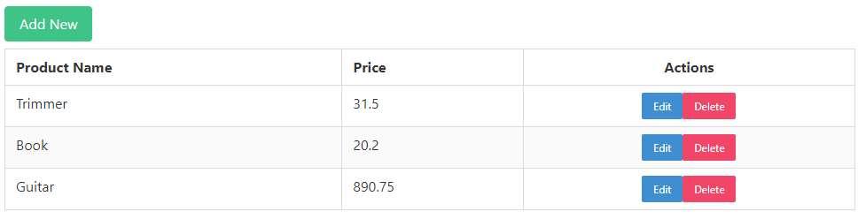

# Vue_CRUD

## Description
This is a full stack Vue CRUD. CRUD stands for create, read, update and delete.
This app allow the user to list, add, delete and modify products from a database.

## Design


## Technologies
### Backend
- Node (v18.12.1): JavaScript backend framework ([download](https://nodejs.org/en/download/)).
- Express (v4.17.3): manage servers and routes ([download](https://www.npmjs.com/package/express)).
- MySQL Server (v8.0.31): database management system ([download](https://dev.mysql.com/downloads/installer/)).
### Frontend
- Vue (v3.0.0): JavaScript framework for building user interfaces ([install](https://cli.vuejs.org/)).
- Axios (v0.26.1): HTTP Client for making HTTP request from the browser ([download](https://www.npmjs.com/package/axios)).
- Bulma (v0.9.3): CSS styling framework ([install](https://bulma.io/documentation/overview/start/)).

## Execution
To import the database, first create the schema called product, then run dump_script.sql file.

To execute the web app execute the next command and acces to ```http://localhost:8080/```
```
npm run serve
```
